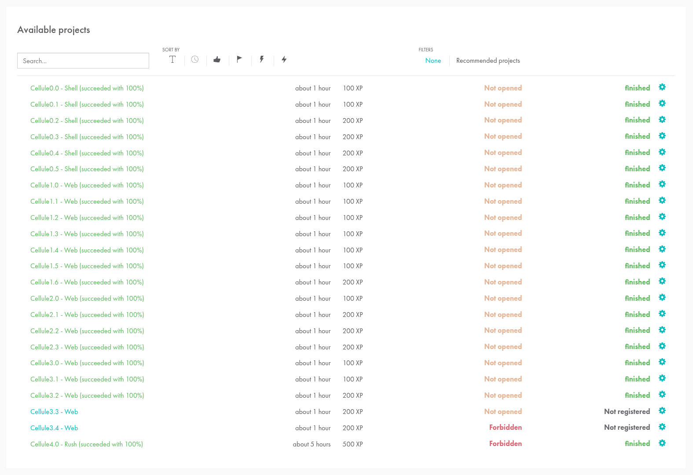

Je connaissais déjà la programmation mais je me suis lancée dans la piscine discovery de Lyon (également un passage des mois plus tôt à celle de Paris) pour découvrir l'école (en vu de tenter la piscine).

Un retour ici, avec un résumé des consignes et mes exercices en retour (comme je connaissais déjà, c'était assez simple pour la plupart).

La semaine de cinq jours était divisée en cinq modules (un par jour) :
 - Shell
 - HTML
 - CSS
 - JS
 - Rush (reprend concept html/css/js dans un site CV)

Petite image de mon avancée (prise en fin de semaine) :

DISCLAIMER :
Si vous êtes de la Piscine Discovery en ce moment même, bravo vous avez trouvé ça. Par contre vous n'apprendrez pas grand chose si vous vous servez en copier-coller de ce que j'ai fait (hors l'apprentissage est un cadeau qu'on ne peut pas esquiver par volonté de gagner du temps).
Faites ce pour quoi est prévu l'école : Cherchez par vous-mêmes. Sur Internet. Voir l'IA. Et si vous restez bloqué, demandez. C'est l'esprit de 42, alors n'hésitez pas à solliciter vos pairs :).